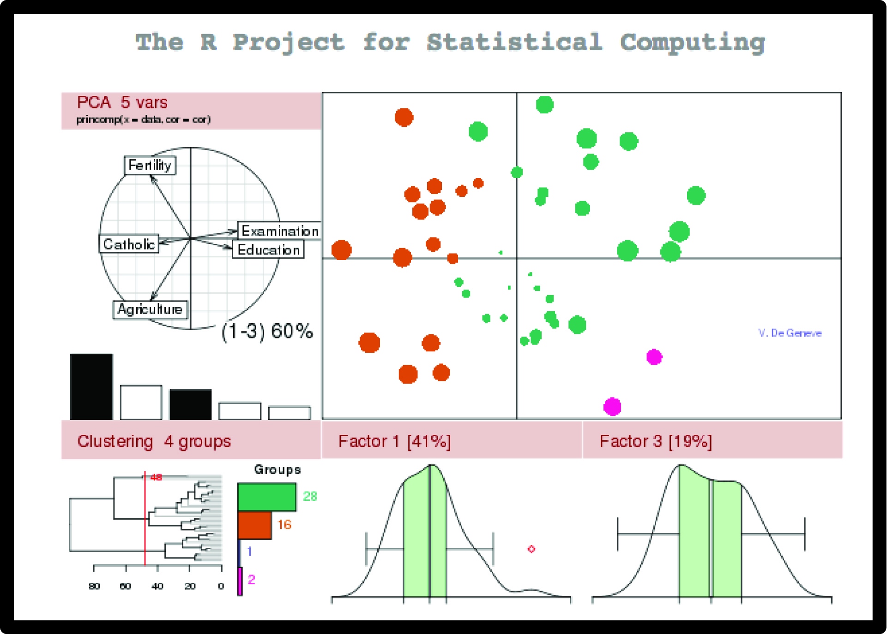
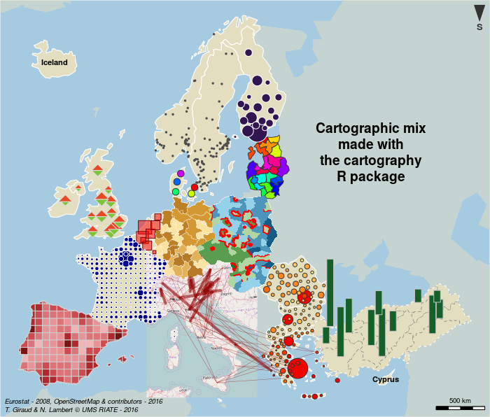
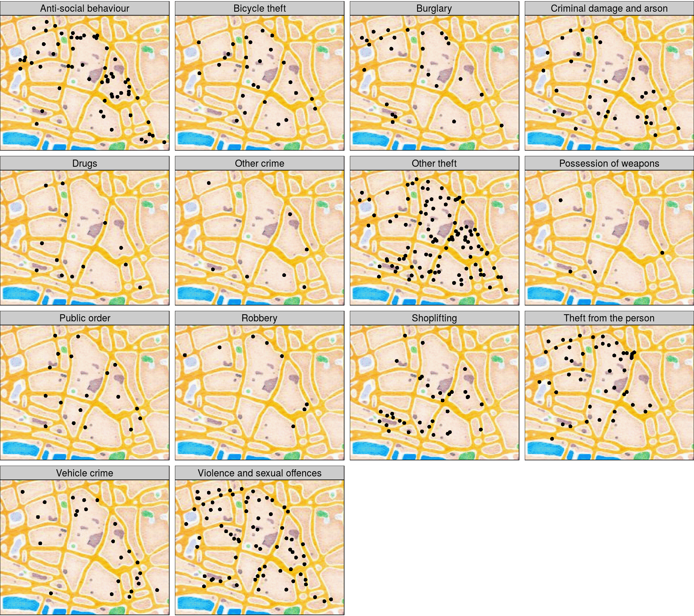
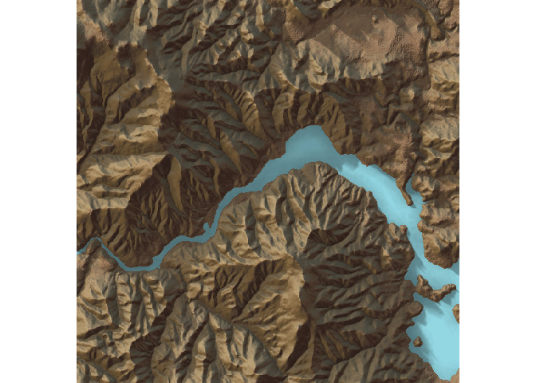

```{r setup, include=FALSE}
options(htmltools.dir.version = FALSE)

library(knitr)
opts_chunk$set(fig.height = 6, fig.width = 8)
```


## R: Not only for stats

```{r GISwithR-1, echo=FALSE, out.width = "640px", out.height = "480px"}

```


---

class: inverse, center, middle

# R can make beautiful maps

---

## Made in R

```{r GISwithR-2, echo=FALSE, out.width = "640px", out.height = "480px"}
include_graphics("images/bike_ggplot.png")
```

<small>http://spatial.ly/2012/02/great-maps-ggplot2/</small>

--- 

##  Made in R

```{r GISwithR-3, echo=FALSE, out.width = "640px", out.height = "480px"}
include_graphics("images/facebook_map.png")
```

<small>http://paulbutler.org/archives/visualizing-facebook-friends/</small>

---

##  Made in R

```{r GISwithR-4, echo=FALSE, out.width = "580px", out.height = "480px"}
include_graphics("images/airMadrid_stamen.png")
```

<small>http://oscarperpinan.github.io/spacetime-vis/</small>

---

##  Made in R

```{r GISwithR-5, echo=FALSE, out.width = "640px", out.height = "480px"}
include_graphics("images/cft.png")
```

<small>http://oscarperpinan.github.io/spacetime-vis/</small>

---

##  Made in R

```{r GISwithR-6, echo=FALSE, out.width = "640px", out.height = "480px"}

```

<small>http://oscarperpinan.github.io/spacetime-vis/</small>


---

## Made in R

```{r GISwithR-7, echo=FALSE, out.width = "640px", out.height = "480px"}
library(leaflet)
leaflet() %>% 
  addTiles() %>% 
  fitBounds(-10, 30, 0, 40) %>%
  addMarkers(-6, 36.5, popup = "You are here")
```

<small>https://rstudio.github.io/leaflet/</small>

---

## Made in R

```{r GISwithR-8, echo=FALSE, out.width = "480px", out.height = "480px"}
include_graphics("images/spinglobe.gif")
```

<small>http://spatial.ly/2017/05/spinning-globes-with-r/</small>

---

##  Made in R

```{r GISwithR-9, echo=FALSE, out.width = "720px", out.height = "400px"}
include_graphics("images/sciencemap.jpg")
```

<small>http://science.sciencemag.org/content/suppl/2016/09/28/353.6307.1532.DC1</small>

---

##  Made in R

```{r GISwithR-10, echo=FALSE, out.width = "640px", out.height = "400px"}

```

<small>https://cran.r-project.org/package=cartography</small>


---

##  Made in R

```{r GISwithR-11, echo=FALSE, out.width = "640px", out.height = "400px"}

```

<small>https://cran.r-project.org/package=tmap</small>

---

##  Made in R

```{r GISwithR-12, echo=FALSE, out.width = "640px", out.height = "400px"}

```

<small>https://github.com/tylermorganwall/rayshader</small>


---

##  Made in R

```{r GISwithR-13, echo=FALSE, out.width = "640px", out.height = "400px"}
include_graphics("images/rayshader-2.jpg")
```

<small>https://github.com/tylermorganwall/rayshader</small>


---

class: inverse, center, middle

# R can make beautiful maps

And beautiful stats too


---

class: inverse, center, middle

# Spatial data in R

Using R as a GIS

---

## Basic packages for spatial data

- sf (sp)
- raster (stars)
- rgeos
- rgdal

And many more: see

- [Spatial CRAN Task View](https://cran.r-project.org/web/views/Spatial.html)

- [Mapping Task View](https://github.com/ropensci/maptools)


---

## Spatial data types in R

- **Vectorial** (sp/sf):
    - Points 
    - Lines 
    - Polygons 
  
- **Raster**:
    - RasterLayer: 
      - 1 grid
    - RasterStack: 
      - multiple layers with same extent, resolution & projection
    - RasterBrick: 
      - multiple layers (= RasterStack) but stored in a single file

---

class: inverse, center, middle

# Vector data

---

## Importing vector data

```{r GISwithR-14, include = FALSE}
## Download dataset to be used later
library(rnaturalearth)
library(dplyr)
library(sf)
countries <- rnaturalearth::ne_countries(continent = "Europe", returnclass = "sf")
countries <- dplyr::select(countries, name, pop_est, gdp_md_est, subregion, geometry) %>%
  dplyr::filter(name != "Russia") %>%
  st_crop(xmin = -30, ymin = 30, xmax = 45, ymax = 85)
sf::st_write(countries, "data/eucountries.shp", delete_dsn = TRUE)
```


```{r GISwithR-15 }
library(sf)
countries <- st_read("data/eucountries.shp")  # or gpkg, etc
```

---

## `sf` objects are data.frames! (w/ geometry column)

```{r GISwithR-16 }
head(countries)
```

---

## So we can easily manipulate them (e.g. dplyr)

Remove column:

```{r GISwithR-17 }
library(dplyr)
countries <- dplyr::select(countries, -gdp_md_est)
```

---

## So we can easily manipulate them (e.g. dplyr)

Filter cases:

```{r GISwithR-18 }
west.eu <- filter(countries, subregion == "Western Europe")
west.eu
```

---

## So we can easily manipulate them (e.g. dplyr)

Summarise data:

```{r GISwithR-19 }
countries %>%
  group_by(subregion) %>%
  summarise(mean(pop_est))
```

---

## So we can easily manipulate them (e.g. dplyr)

Create new columns:

```{r GISwithR-20 }
countries <- mutate(countries, pop.million = pop_est/1000000)
```

---

## Basic plotting

```{r GISwithR-21, fig.width=10}
plot(countries)
```

---

## Basic plotting

```{r GISwithR-22, fig.width=10}
plot(countries["subregion"])
```

---

## Interactive plot (leaflet)

```{r GISwithR-23 }
library(mapview)
mapview(countries)
```


---

## Plotting sf objects with ggplot2

```{r GISwithR-24, echo=c(2,3)}
library(ggplot2)
ggplot() +
  geom_sf(data = countries, aes(fill = subregion))
```


---

## Plotting sf objects with ggplot2

```{r GISwithR-25 }
ggplot() +
  geom_sf(data = countries, aes(fill = name)) +
  theme(legend.position = "none")
```


---

## Plotting sf objects with ggplot2

```{r GISwithR-26 }
ggplot() +
  geom_sf(data = countries, aes(fill = pop.million))
```


---

## Plotting with tmap

```{r GISwithR-27, fig.height=5 }
library(tmap)
tm_shape(countries) +
  tm_fill(col = "subregion") +
  tm_layout(legend.position = c("left", "top"))
```


---
class: inverse, middle, center

# How to create sf from an R object?

---

## Making a data frame *spatial*

```{r GISwithR-28 }
mydf <- read.csv("data/occs.csv")
head(mydf)
```


---

## Making a data frame *spatial*

```{r GISwithR-29 }
occs <- st_as_sf(mydf, coords = c("x", "y"))
head(occs)
```

---

## Setting the projection (Coordinate Reference System)

```{r GISwithR-30 }
st_crs(occs) <- "+proj=longlat +ellps=WGS84 +datum=WGS84"
```

See http://spatialreference.org 
  

---

## Changing projection

```{r GISwithR-31 }
occs.laea <- st_transform(occs, crs = 3035)
occs.laea
```

---

## Leaflet map (mapview)

```{r GISwithR-32 }
mapview(occs)
```

---

## Leaflet map (leaflet)

```{r GISwithR-33, out.height = "480px" }
leaflet(occs) %>%
  addTiles() %>%
  addMarkers(popup = ~species)
```

<small>https://rstudio.github.io/leaflet/</small>


---

## Plotting with ggspatial

```{r GISwithR-34, message=FALSE, fig.height=4}
library(ggspatial)
ggplot() + 
  annotation_map_tile() +
  layer_spatial(occs, size = 5, aes(colour = species))
```

<small>Basemap Copyright OpenStreetMap Contributors CC-BY-SA</small>

---

## Plotting with ggspatial

```{r GISwithR-35, message=FALSE, fig.height=4}
ggplot() + 
  annotation_map_tile(type = "stamenwatercolor") +
  layer_spatial(occs, size = 5)
```

<small>Basemap Copyright OpenStreetMap Contributors CC-BY-SA</small>


---

## Convert sf to Spatial* object (sp)

```{r GISwithR-36 }
occs.sp <- as(occs, "Spatial")
occs.sp
```


---
class: inverse, middle, center

# How to save/export vector data?

---

## Saving vector data

```{r GISwithR-37 }
st_write(countries, "data/countries.gpkg", delete_dsn = TRUE)
```


---
class: inverse, middle, center

# Geocoding

---

## Geocoding

```{r GISwithR-38, eval=TRUE}
myplace <- tmaptools::geocode_OSM("Granada, Spain")
myplace
```


Other packages: opencage, dismo, ggmap, geocodeHERE, rmapzen...


---
class: inverse, middle, center

# Raster data

---

## Download raster (and vector) data

```{r GISwithR-40, message=FALSE, }
library(raster)
bioclim <- getData('worldclim', var = "bio", res = 10)
bioclim
```

---

## Importing raster data from disk

One grid only (1 layer):

```{r GISwithR-41 }
ras <- raster("wc10/bio1.bil")
ras
```

---

## Importing raster data from disk

Multiple grids:

```{r GISwithR-42 }
files <- list.files("wc10", pattern = "bio\\d+.bil", full.names = TRUE)
manylayers <- stack(files)
manylayers
```

---

## Setting the projection (Coordinate Reference System)

```{r GISwithR-43 }
crs(ras) <- "+proj=longlat +ellps=WGS84 +datum=WGS84"
```

See http://spatialreference.org 
  
To change projection: `projectRaster`

---

## Basic raster plotting

```{r GISwithR-44 }
plot(ras)
```

---

## rasterVis

```{r GISwithR-45, message=FALSE}
library(rasterVis)
levelplot(ras, margin = FALSE)
```


---

## Crop (change extent)

```{r GISwithR-46 }
ras.crop <- crop(ras, countries)
plot(ras.crop)
```

---

## Plot raster with ggplot2

```{r GISwithR-47 }
ras.df <- as.data.frame(ras.crop, xy = TRUE)
ggplot(ras.df) +
  geom_raster(aes(x = x, y = y, fill = bio1))
```


---

## Change resolution

```{r GISwithR-48 }
ras.coarse <- aggregate(ras.crop, fact = 4, fun = mean)
ras.coarse
```


---

## Extract values from rasters

```{r GISwithR-49, echo=TRUE}
vals <- extract(ras, occs)
head(vals)
```

---

## Extract values from rasters

```{r GISwithR-50, echo=c(1,2)}
vals <- extract(ras, countries, fun = mean)
head(vals)
#vals <- extract(manylayers, occs.sp)
```

---

## Save raster data

```{r GISwithR-51, eval=FALSE}
writeRaster(ras, filename = "myraster.grd")
```

KML (Google Earth):

```{r GISwithR-52, eval=FALSE}
KML(ras, filename = "myraster.kmz", overwrite = TRUE)
```


---

## Remote sensing too


http://bleutner.github.io/RStoolbox/

And many more packages! (MODIS, Landsat, LiDAR...)

---

## Why doing GIS in R

- Harness all **stats & data management power** from R

  - Data wrangling

  - Modelling

  - Dataviz

- Fully-**reproducible** scripts


---

## Running GIS geoprocessing algorithms from R

- RQGIS

- rgrass7

- RSAGA

- ArcGIS

```{r GISwithR-53, echo=FALSE, out.width = "360px", out.height = "240px"}
include_graphics("images/R_ArcGis.png")
```


---

## Some tutorials

- https://geocompr.robinlovelace.net/

- https://bhaskarvk.github.io/user2017.geodataviz/

- https://github.com/Nowosad/gis_with_r_how_to_start

- http://www.rspatial.org/

- http://r-spatial.github.io/sf/

- http://book.ecosens.org/

- http://pakillo.github.io/R-GIS-tutorial

- https://datacarpentry.org/geospatial-workshop/

- http://jafflerbach.github.io/spatial-analysis-R/intro_spatial_data_R.html

- https://github.com/USEPA/intro_gis_with_r

- http://www.nickeubank.com/gis-in-r/

- [Spatial R cheatsheet](https://github.com/wegmann/RSdocs/blob/master/RSecology_cheatsheet/RS_ecology_refcard.pdf)

- etc


---
class: inverse, middle, center

# Exercises


---

## Map distribution of species occurrences (rgbif)

```{r GISwithR-54, echo=FALSE}
library(rgbif)
qpyr <- occ_search(scientificName = "Quercus pyrenaica", 
                     country = "ES", hasCoordinate = TRUE, 
                     return = "data")
qpyr.sf <- st_as_sf(qpyr, 
                      coords = c("decimalLongitude", "decimalLatitude"), 
                      crs = "+proj=longlat +ellps=WGS84 +datum=WGS84")
ggplot() +
  borders(fill = "grey90", colour = "grey90") +
  geom_sf(data = qpyr.sf) +
  xlim(-10, 5) + ylim(35, 45) +
  theme_bw() +
  labs(x = "", y = "", 
       title = "Quercus pyrenaica occurrences in GBIF")
  
```


---

## Geocode and map address

```{r GISwithR-55, echo = FALSE, message=FALSE, eval=FALSE}
#library(ggmap)
#here <- ggmap::geocode("Tarifa", source = "google")
here <- data.frame(lon = -5.60445, lat = 36.01432)
tarifa <- st_as_sf(here, coords = c("lon", "lat"), 
                   crs = "+proj=longlat +ellps=WGS84 +datum=WGS84")
library(ggspatial)
ggplot() + 
  annotation_map_tile(zoom = 5) + 
  layer_spatial(tarifa)
```

Interactive map

```{r GISwithR-56, echo = FALSE}
library(mapview)
teide <- data.frame(lon = -16.64, lat = 28.27)
loc <- st_as_sf(teide, coords = c("lon", "lat"), 
                   crs = "+proj=longlat +ellps=WGS84 +datum=WGS84")
#mapView(loc)
# to display suitable zoom:
mapview(loc)@map %>% setView(lng = -16.64, lat = 28.27, zoom = 9)
```

---

## January Precipitation in Spain (raster)

```{r GISwithR-57, echo=FALSE}
library(raster)
prec <- getData("worldclim", var = "prec", res = 10)
prec.sp <- crop(prec, c(-10, 5, 35, 45))
plot(prec.sp, 1, main = "")
```

---

## January Precipitation in Spain (leaflet)

```{r GISwithR-58, echo=FALSE}
library(mapview)
prec.jan <- prec.sp[[1]]
mapview(prec.jan)
```

---

## Monthly Precipitation in Spain (rasterVis)

```{r GISwithR-59, echo=FALSE}
library(rasterVis)
levelplot(prec.sp)
```

---

## Elevation map of Spain

```{r GISwithR-60, echo=FALSE}
# Get elevation data from the internet 
elev <- getData("alt", country = "Spain")

# Crop raster to desired extent
ele <- crop(elev, c(-10, 5, 35, 45))

plot(ele, col = topo.colors(16), alpha = 0.5, interpolate = TRUE)
#contour(ele, levels = seq(0, 4000, 1000), add = TRUE)
```


---

## END


Slides and source code available at https://github.com/Pakillo/GISwithR


