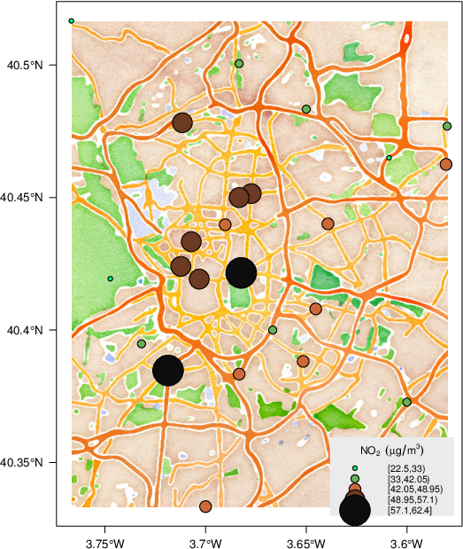

GIS with R: slides for the unconverted
========================================================
author: Francisco Rodriguez-Sanchez
date: @frod_san
2015-11-14


R: not only for stats
=====================


R can make beautiful maps
=========================
type: section


Made in R
==========


<small>http://spatial.ly/2012/02/great-maps-ggplot2/</small>


Made in R
=========


<small>http://paulbutler.org/archives/visualizing-facebook-friends/</small>


Made in R
=========



<small>http://oscarperpinan.github.io/spacetime-vis/</small>


Made in R
=========


<small>http://oscarperpinan.github.io/spacetime-vis/</small>


Made in R
=========


<small>http://oscarperpinan.github.io/spacetime-vis/</small>


And it's very easy!
===================
type: section


Map species occurrences in 2 lines of code
==========================================


```r
plot(gmap(occdata, type = "satellite"))
points(occdata, col = "red", pch=20, cex = 2)
```


Let's go step by step
=====================
type: section


A dataframe of species occurrences
==================================


|   |species               |    lon|    lat|
|:--|:---------------------|------:|------:|
|1  |Solanum acaule Bitter | -66.10| -21.90|
|2  |Solanum acaule Bitter | -71.00| -13.50|
|52 |Solanum acaule Bitter | -66.43| -24.22|
|53 |Solanum acaule Bitter | -72.07| -13.35|
|54 |Solanum acaule Bitter | -68.97| -15.23|
|55 |Solanum acaule Bitter | -64.95| -17.75|


Make it a spatial object
========================


```r
coordinates(occs) <- c("lon", "lat")
str(occs, 2)
```

```
Formal class 'SpatialPointsDataFrame' [package "sp"] with 5 slots
  ..@ data       :'data.frame':	49 obs. of  1 variable:
  ..@ coords.nrs : int [1:2] 2 3
  ..@ coords     : num [1:49, 1:2] -66.1 -71 -66.4 -72.1 -69 ...
  .. ..- attr(*, "dimnames")=List of 2
  ..@ bbox       : num [1:2, 1:2] -72.5 -24.2 -64.7 -12.5
  .. ..- attr(*, "dimnames")=List of 2
  ..@ proj4string:Formal class 'CRS' [package "sp"] with 1 slot
```


Specify projection (CRS)
========================


```r
crs(occs) <- CRS("+proj=longlat +ellps=WGS84 +datum=WGS84")
```

See http://spatialreference.org


Project to Mercator and plot
============================


```r
plot(gmap(occs, type = "satellite"))
points(Mercator(occs), col = "red", pch = 20, cex = 2)
```


Alternatively, load shapefile
=============================


```r
occs <- shapefile("occs.shp")
plot(gmap(occs, type = "satellite"))
points(Mercator(occs), col = "red", pch = 20, cex = 2)
```


Using ggmap
===========


```r
library(ggmap)
map <- get_map(bbox(occs), maptype = "watercolor", source = "stamen")
ggmap(map) +
  geom_point(aes(x = coords.x1, y = coords.x2), data = as.data.frame(coordinates(occs)),
             colour = "red", size = 4)
```


Raster data
===========
type: section


Download elevation data
==========================


```r
elevation <- getData("alt", country = "ESP")
```


```r
library(rasterVis)
levelplot(elevation)
```


Dynamic interactive maps with leaflet
=====================================


```r
library(mapview)
mapView(occs)
```


Remote sensing growing fast
===========================

e.g. RStoolbox


Doing GIS in R: main advantages
===============================
incremental: true

- Fully-reproducible scripts

- **Harness all R stats power**

  - Data wrangling

  - Modelling

  - Dataviz

- Easy!


Calling GIS from R
==================

- Grass: [`spgrass6`](http://www.rdocumentation.org/packages/spgrass6)
- SAGA: [`RSAGA`](http://www.rdocumentation.org/packages/RSAGA)
- ArcGIS: https://github.com/R-ArcGIS


Includes calling R from ArcGIS too


To read more
============

http://pakillo.github.io/R-GIS-tutorial


