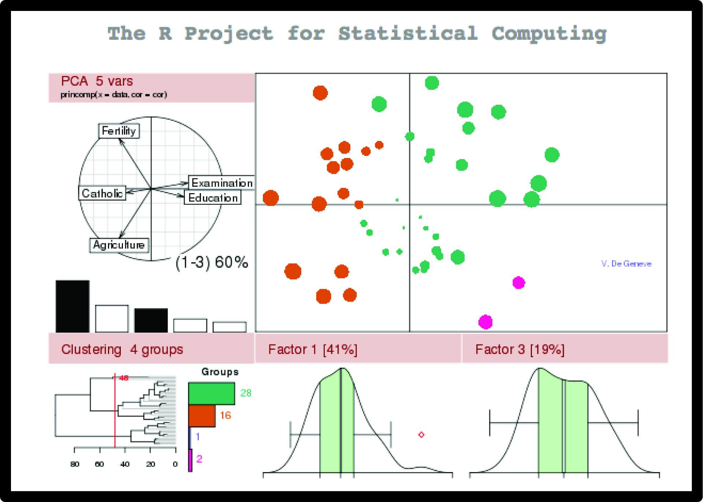
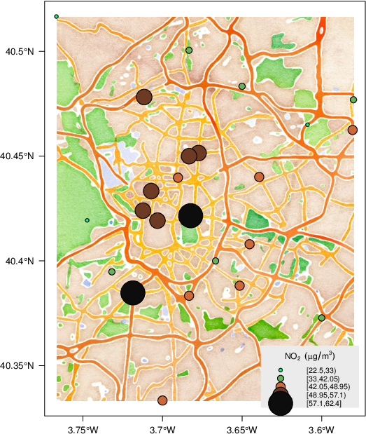
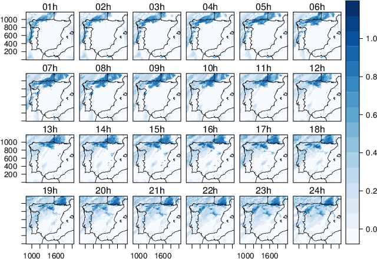
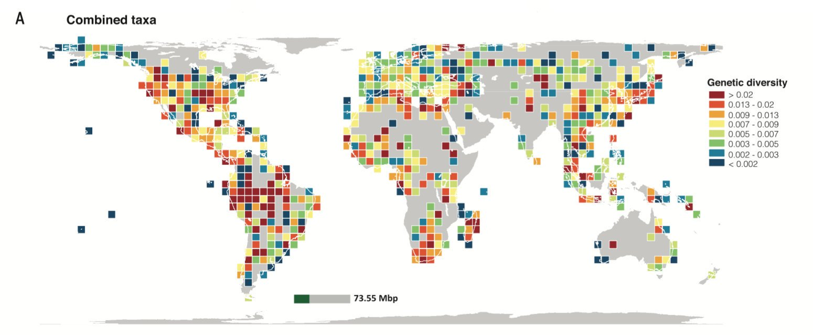
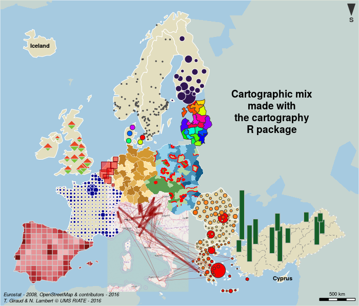
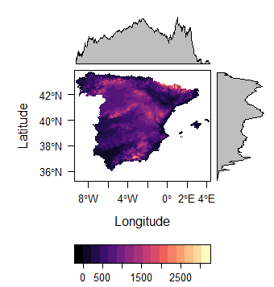
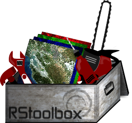

```{r knitr_setup, include=FALSE, cache=FALSE}

library(knitr)

### Chunk options ###

## Text results
opts_chunk$set(echo = TRUE, warning = FALSE, message = FALSE, eval = TRUE, size = 'footnotesize')

## Code decoration
opts_chunk$set(tidy = FALSE, comment = NA, highlight = TRUE, prompt = FALSE, crop = FALSE)

# ## Cache
opts_chunk$set(cache = TRUE, cache.path = "knitr_output/cache/")

# ## Plots
opts_chunk$set(fig.path = "knitr_output/figures/")
opts_chunk$set(fig.align = 'center')

### Hooks ###
## Crop plot margins
knit_hooks$set(crop = hook_pdfcrop)

## Reduce font size
# see http://stackoverflow.com/a/39961605
knit_hooks$set(smallfont = function(before, options, envir) {
  if (before) return(paste0("\n \\", options$size, "\n\n"))
  else return("\n\n \\normalsize \n")
  })

```


## R: not only for stats

```{r echo=FALSE, out.width = "640px", out.height = "480px"}

```


# R can make beautiful maps


## Made in R

```{r echo=FALSE, out.width = "640px", out.height = "480px"}
include_graphics("images/bike_ggplot.png")
```

<small>http://spatial.ly/2012/02/great-maps-ggplot2/</small>


##  Made in R

```{r echo=FALSE, out.width = "640px", out.height = "480px"}
include_graphics("images/facebook_map.png")
```

<small>http://paulbutler.org/archives/visualizing-facebook-friends/</small>


##  Made in R

```{r echo=FALSE, out.width = "580px", out.height = "480px"}

```

<small>http://oscarperpinan.github.io/spacetime-vis/</small>


##  Made in R

```{r echo=FALSE, out.width = "640px", out.height = "480px"}

```

<small>http://oscarperpinan.github.io/spacetime-vis/</small>


##  Made in R

```{r echo=FALSE, out.width = "640px", out.height = "480px"}

```

<small>http://oscarperpinan.github.io/spacetime-vis/</small>


##  Made in R

```{r echo=FALSE, out.width = "720px", out.height = "400px"}

```

http://science.sciencemag.org/content/suppl/2016/09/28/353.6307.1532.DC1


##  Made in R

```{r echo=FALSE, out.width = "640px", out.height = "400px"}

```

https://cran.r-project.org/package=cartography


# And it's easy!

## Map occurrences in 2 lines of code

```{r echo=FALSE}
library(knitr)
library(dismo)
data(acaule)
acaule <- acaule[acaule$continent == "South America", ]
acaule <- acaule[!is.na(acaule$lat) | !is.na(acaule$lon), ]
acaule <- subset(acaule, select = c("species", "lon", "lat"))
crs.geo <- CRS("+proj=longlat +ellps=WGS84 +datum=WGS84")
occs <- acaule
acaule.sp <- acaule
coordinates(acaule.sp) <- c("lon", "lat")
crs(acaule.sp) <- crs.geo
occdata <- Mercator(acaule.sp)
```

```{r fig.keep = "last"}
plot(gmap(occdata, type = "satellite"))
points(occdata, col = "red", pch=20, cex = 2)
```


# Let's go step by step


## Dataframe with coordinates

```{r echo=FALSE}
kable(head(occs))
```


## Make it a spatial object

```{r}
coordinates(occs) <- c("lon", "lat")
str(occs, 2)
```


## Specify projection (CRS)

```{r}
crs(occs) <- CRS("+proj=longlat +ellps=WGS84 +datum=WGS84")
```

See http://spatialreference.org


## Project to Mercator and plot

```{r fig.keep = "last"}
plot(gmap(occs, type = "satellite"))
points(Mercator(occs), col = "red", pch = 20, cex = 2)
```


## Alternatively, load shapefile

```{r echo = FALSE}
shapefile(occs, filename = "occs.shp", overwrite = TRUE)
```


```{r fig.keep = "last"}
occs <- shapefile("occs.shp")
plot(gmap(occs, type = "satellite"))
points(Mercator(occs), col = "red", pch = 20, cex = 2)
```


## Using ggmap

```{r eval=TRUE}
library(ggmap)
map <- get_map(bbox(occs), maptype = "watercolor", source = "stamen")
ggmap(map) +
  geom_point(aes(x = coords.x1, y = coords.x2), 
             data = as.data.frame(coordinates(occs)),
             colour = "red", size = 4)
```


# Raster data


## Download elevation data

```{r out.width = "640px", out.height = "400px"}
elevation <- getData("alt", country = "ESP")
plot(elevation)
```


## Using rasterVis

```{r echo=TRUE, eval=FALSE, out.width = "640px", out.height = "480px"}
library(rasterVis)
levelplot(elevation)
```

```{r echo=FALSE, out.width = "600px", out.height = "400px"}

```


## Dynamic interactive maps (leaflet)

```{r out.width = "640px", out.height = "480px"}
library(mapview)
mapView(occs)
```


## Remote sensing too



http://bleutner.github.io/RStoolbox/

And many more packages! (MODIS, Landsat, LiDAR...)


## Why doing GIS in R

- Fully-reproducible scripts

- **Harness all R stats power**

  - Data wrangling

  - Modelling

  - Dataviz

- Easy!


## Running GIS geoprocessing algorithms from R

- RQGIS
- rgrass7
- RSAGA
- ArcGIS

```{r echo=FALSE, out.width = "360px", out.height = "240px"}
include_graphics("images/R_ArcGis.png")
```


## Some tutorials

- https://bhaskarvk.github.io/user2017.geodataviz/

- https://github.com/Nowosad/gis_with_r_how_to_start

- http://www.rspatial.org/

- http://r-spatial.github.io/sf/

- http://book.ecosens.org/

- http://robinlovelace.net/geocompr/

- http://pakillo.github.io/R-GIS-tutorial

- http://neondataskills.org/tutorial-series/

- http://jafflerbach.github.io/spatial-analysis-R/intro_spatial_data_R.html

- https://github.com/USEPA/intro_gis_with_r

- http://www.nickeubank.com/gis-in-r/

- [Spatial R cheatsheet](https://github.com/wegmann/RSdocs/blob/master/RSecology_cheatsheet/RS_ecology_refcard.pdf)

- etc


-----


Slides and source code available at https://github.com/Pakillo/GISwithR


